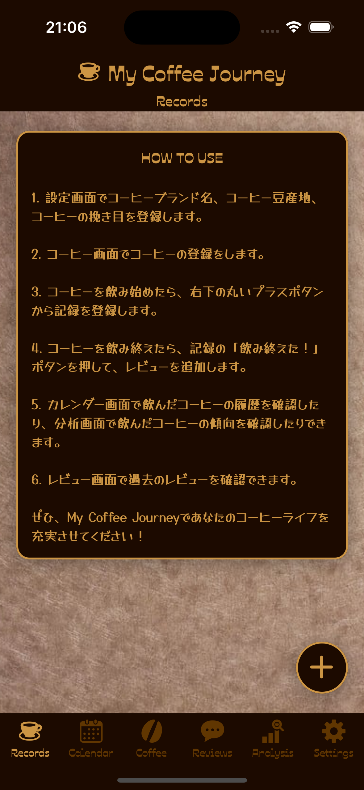
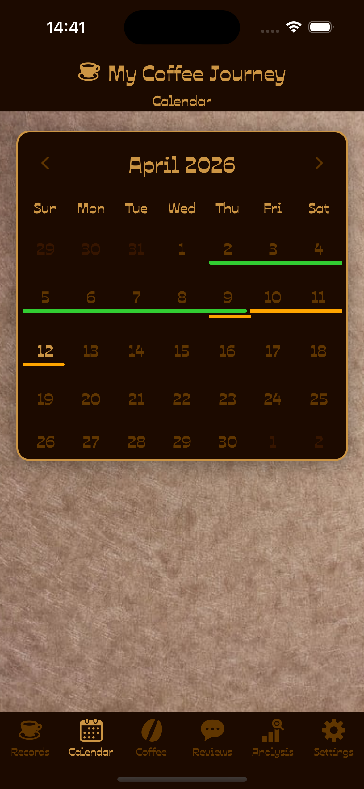
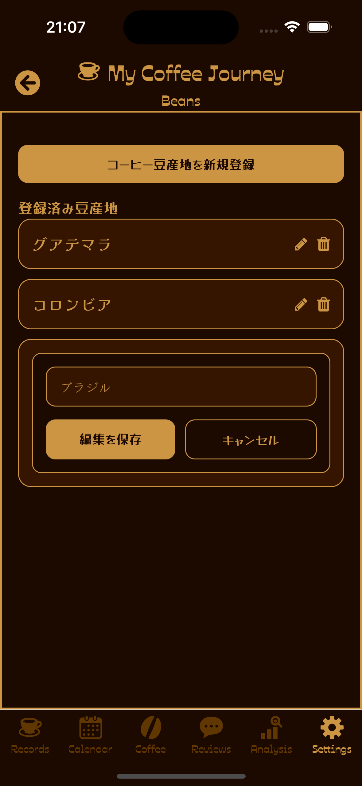
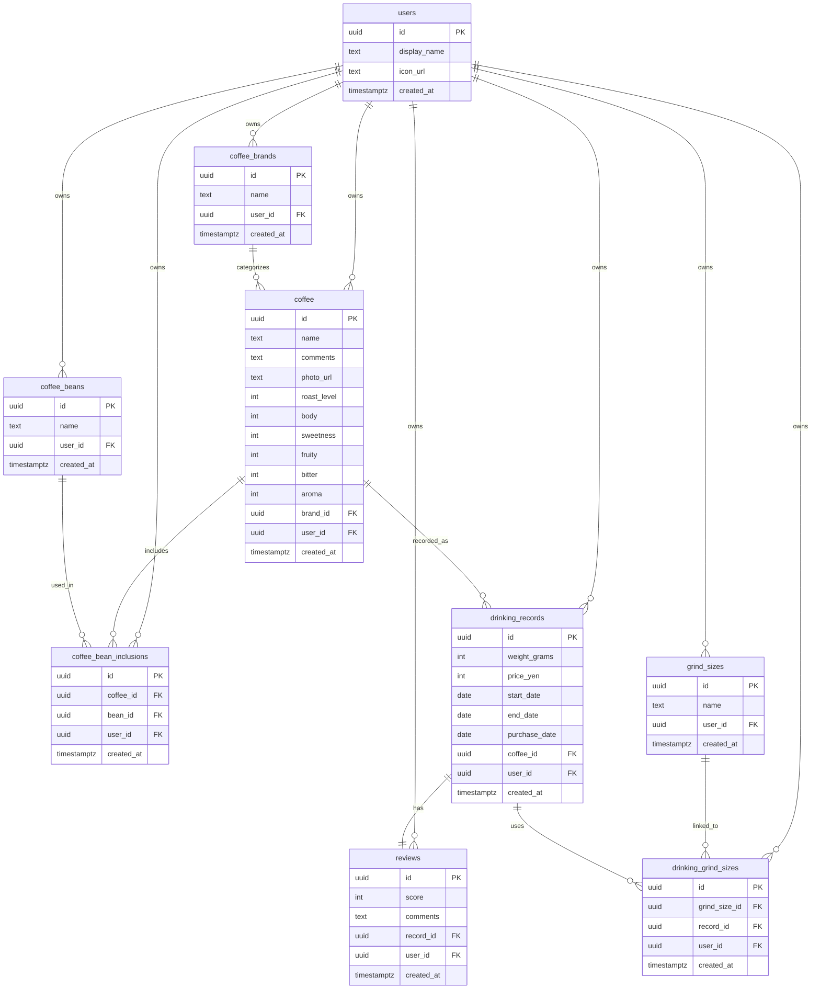

# MyCoffeeJourney v2


## 概要

個人のコーヒー体験を、記録・評価・分析まで一貫して管理できる React Native アプリです。<br>
以前作成した v1 をベースに「継続して使える記録アプリ」として作り直しました。<br>
「何を飲んだか」だけで終わらせず、ブランド・豆・挽き目・飲用期間・レビューを構造化して蓄積し、あとから振り返れる形に整理しています。
<br>

- 対象ユーザー: 自分が飲んだコーヒーを継続的に記録し、好みの傾向まで見返したい個人ユーザー
- 解決したい課題: コーヒーの記録がメモや写真に散らばって振り返りにくい、評価と消費履歴が混ざって管理しづらい
- 技術的な見せ場: データ正規化、飲用記録とレビューの分離、モバイル向けの読込体験改善、カレンダーと分析画面による振り返り導線

## スクリーンショット

<p align="center">
  
  
  
</p>

| 画面       | 見どころ                                             |
| ---------- | ---------------------------------------------------- |
| How To Use | 初回利用時に、登録順序と使い方を迷わず理解できる導線 |
| Calendar   | 飲用履歴を日付単位で振り返れるカレンダービュー       |
| Beans      | マスタデータを編集・再利用できる管理画面             |

## 主な機能

### 記録

- メール OTP を使ったユーザー登録 / ログイン
- コーヒーごとの飲用記録の登録
- 飲み終えたタイミングでのレビュー追加

### 管理

- コーヒー情報の登録・編集・削除
- ブランド・豆・挽き目のマスタ管理
- コーヒー一覧での検索と再利用しやすいデータ構造

### 振り返り

- カレンダーによる飲用履歴の可視化
- レビュー履歴の一覧表示
- 集計値とグラフによる分析画面

## 設計・実装のポイント

### 1. データモデリング

- ブランド・豆・挽き目をコーヒー本体から分離し、重複入力を避ける構造にしています
- `coffee_bean_inclusions` や `drinking_grind_sizes` を中間テーブルにして、多対多の関係を表現しています
- 飲用記録とレビューを分離し、消費履歴と評価履歴を別の文脈で扱えるようにしています

### 2. 画面遷移と情報設計

- 詳細画面から記録詳細へ遷移したあとも、元の文脈に戻りやすいように戻り先情報を保持しています
- 一覧、詳細、設定、分析が役割ごとに分かれ、ユーザーの行動単位に沿った画面構成にしています
- 初回利用時には How To Use を表示し、登録の順番が自然に理解できるようにしています

### 3. 状態管理

- セッションやユーザー情報は Zustand を使って軽量に管理しています
- 画面ごとのローカル状態は React Hooks で完結させ、責務を広げすぎない構成にしています
- Supabase Auth の OTP フローに合わせて、送信中・検証中・再送クールダウンを分けて扱っています

### 4. 読込体験の改善

- 一覧画面や詳細画面では、初回読込中にスケルトン UI を表示しています
- 再訪時は既存データを残したまま静かに再取得し、レイアウトシフトを抑える設計にしています
- 「初回読込」「再取得」「保存中」を分離し、モバイルアプリらしい表示を意識して改善しています

## 技術スタック

| 技術                   | 用途 / 採用理由                                              |
| ---------------------- | ------------------------------------------------------------ |
| React Native + Expo    | iOS / Android を単一コードベースで開発するため               |
| TypeScript             | 型による安全性を持たせ、画面遷移やデータ構造の破綻を防ぐため |
| Supabase               | Auth と PostgreSQL ベースの BaaS をシンプルに構築するため    |
| Zustand                | セッションなどの共有状態を軽量に扱うため                     |
| nativewind             | スタイルの記述速度と一貫性を両立するため                     |
| react-native-calendars | 飲用履歴をカレンダーで可視化するため                         |
| react-native-chart-kit | 集計データをグラフで振り返れるようにするため                 |

## データモデル

このアプリでは、コーヒー体験を「記録可能な構造」として扱うために、マスタ情報と履歴情報を分離しています。
特に、ブランド・豆・挽き目の正規化と、飲用記録 / レビューの責務分離がデータ設計の中心です。

- マスタ情報: ブランド、豆、挽き目
- 履歴情報: 飲用記録、レビュー
- 中間テーブル: コーヒーと豆、飲用記録と挽き目の多対多を表現



## セットアップ / 実行方法

### 前提

- Node.js 20 系を推奨
- Expo 実行環境
- Supabase プロジェクト

### 必須環境変数

以下の環境変数が未設定だと、アプリ起動時に Supabase クライアント生成でエラーになります。

```bash
EXPO_PUBLIC_SUPABASE_URL=your_supabase_project_url
EXPO_PUBLIC_SUPABASE_ANON_KEY=your_supabase_anon_key
```

### ローカル実行

```bash
npm install
npm run ios
# または
npm run android
```

必要に応じて、開発サーバーのみ起動する場合は以下を使います。

```bash
npm start
```

### 補足

- 認証は Supabase Auth のメール OTP を使用しています
- Supabase のプロジェクト設定や SQL マイグレーションはこのリポジトリには同梱していないため、公開時には別途セットアップが必要です

## 開発体制 / 品質管理

GitHub Actions による CI を導入しており、`push` / `pull_request` 時に以下を自動実行しています。

- `npm install`
- `npm run lint`

現時点では静的解析中心ですが、最低限の品質ゲートを通す構成にしています。

## 今後の改善

- テスト拡充: 画面単位のテストや主要ロジックの検証を追加する
- 画像アップロード対応: コーヒー情報に写真を紐づけ、記録体験を強化する
- 分析機能の強化: 好みの傾向や頻度をより見やすく可視化する

## License

This repository is available for viewing and learning purposes only.
Commercial use, redistribution, and code reuse are not permitted. See `LICENSE.md` for details.
