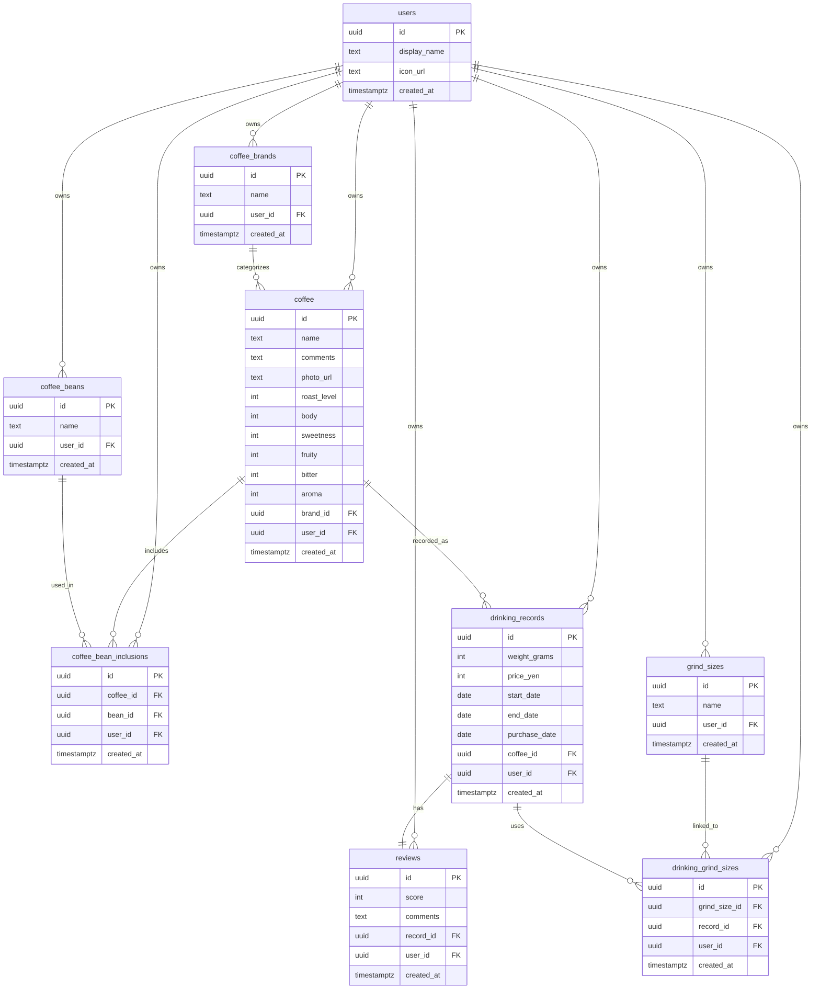

# ☕ MyCoffeeJourney v2 ☕

コーヒーの記録・管理・評価を行うための個人向けアプリケーションです。 
以前作成した v1 を 1 から新規作成して継続利用可能なアプリを目指しています。 
 
ブランド・豆・挽き目といった要素を正規化して管理し、コーヒー情報を再利用可能な構造として設計しています。また、飲用記録とレビューを分離することで、「消費の記録」と「評価」を明確に区別しています。
 
単なるメモとしてではなく、コーヒー体験を構造化されたデータとして蓄積し、後から振り返りや検索がしやすい形で管理できるように設計しました。
 
データモデリングとUXに重点を置いて構築し、アプリケーションの構造と使いやすさの両方に力を入れて設計しています。

  
  
  

## 全体機能・画面遷移構成

### 主な機能一覧

- 新規ユーザー登録／ログイン（Supabase Auth）
- コーヒー豆情報登録・編集・削除
- 飲み始めた豆の記録
- 飲み終えた豆のレビュー記録
- 飲用履歴カレンダー表示
- コーヒー情報一覧
- 飲用データ分析（集計・グラフ表示）

---

## 技術スタック構成

### バックエンド

- **Supabase**
  - PostgreSQL ベースの RDB
  - 認証：OTP 対応
  - ストレージ：画像アップロードも将来的に検討

### フロントエンド

- React Native
- TypeScript
- nativewind（Tailwind 記法でスタイリング）
- react-native-calendars（カレンダー表示）
- @react-native-community/datetimepicker（日付入力）
- @react-native-community/slider（味わい評価のスライダー）

### 状態管理

- Zustand
- Context API との併用検討可能性あり

### ER図

- ユーザーごとのコーヒー記録を中心に、ブランド・豆・挽き目はマスタとして分離しています。
- 飲用中の記録と飲用後のレビューを分けることで、記録フェーズと評価フェーズを分離した構成にしています。

---

## 開発について

本プロジェクトでは GitHub Actions を用いた CI（継続的インテグレーション）を導入しています。

- ESLint（TypeScript + React ルール）による静的コード解析
- push／pull request 時に自動実行
- コード品質を一定水準に保つ仕組みを整備済み

今後はユニットテストやビルド検証も追加予定です。

---

## License

This project is licensed under the MIT License.
